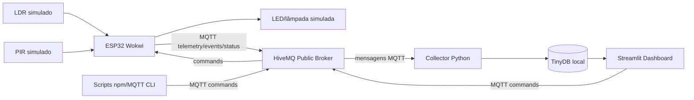
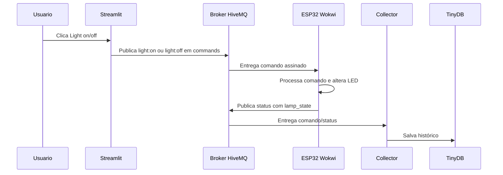
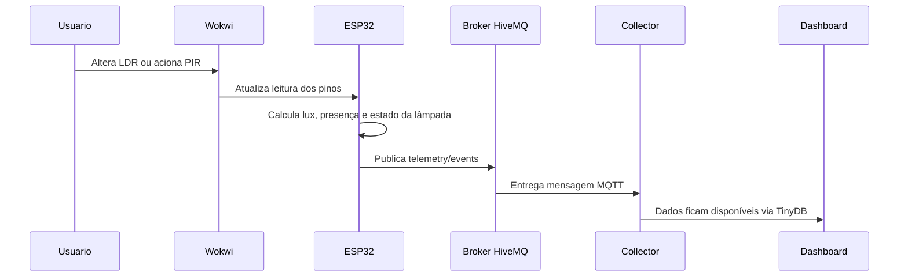
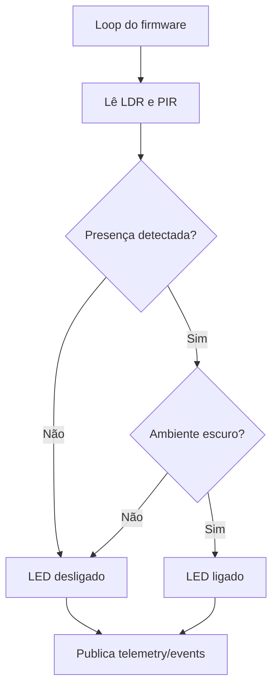
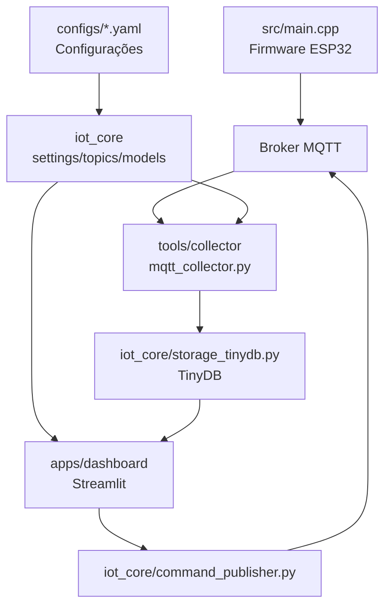
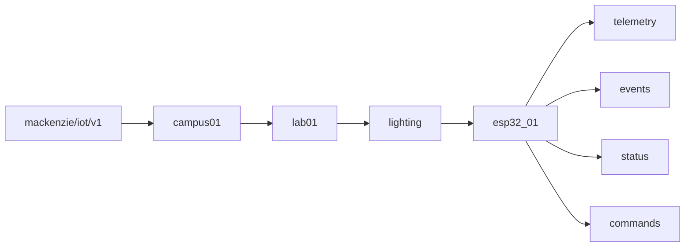

# Testes e resultados MQTT

Este documento descreve como a comunicação MQTT está integrada ao projeto Obj Conect, como reproduzir os testes do protótipo e como registrar os resultados de tempo de resposta.

As medições propostas representam o tempo de resposta do protótipo simulado completo. Elas não representam a latência pura do broker MQTT, pois incluem Wokwi, firmware, rede, broker público HiveMQ, collector local, dashboard e tempo de interação manual.

## Funcionamento e uso do protótipo

O Obj Conect simula uma solução de iluminação inteligente com ESP32 no Wokwi. O firmware lê dois sensores simulados:

- LDR, conectado ao GPIO 34, usado para estimar luminosidade.
- PIR, conectado ao GPIO 26, usado para detectar presença ou movimento.

O atuador é um LED vermelho no GPIO 12, usado para representar a lâmpada. No modo automático, o LED liga quando existe presença e o ambiente está escuro. Também é possível controlar o LED remotamente com comandos MQTT.

Fluxo de uso recomendado:

1. Compilar o firmware com PlatformIO.
2. Iniciar a simulação Wokwi.
3. Rodar o collector MQTT Python.
4. Rodar o dashboard Streamlit.
5. Manipular LDR/PIR no Wokwi e enviar comandos pela página `Commands` ou pelos scripts npm.
6. Registrar os tempos na página `Resultados` do Streamlit e exportar o CSV.

Comandos principais:

```powershell
& "$env:USERPROFILE\.platformio\penv\Scripts\platformio.exe" run
.\.venv\Scripts\python.exe -m tools.collector.mqtt_collector
.\.venv\Scripts\python.exe -m streamlit run apps\dashboard\app.py
npm run mqtt:sub:device
npm run mqtt:pub:light:on
npm run mqtt:pub:light:off
```

## Software desenvolvido

O software do projeto está organizado em quatro partes principais:

- Firmware ESP32 em `src/main.cpp`, desenvolvido em Arduino/C++ com PlatformIO.
- Módulos Python em `iot_core/`, responsáveis por configuração, tópicos, parsing de payloads, publicação de comandos e consultas do dashboard.
- Collector em `tools/collector/mqtt_collector.py`, responsável por assinar tópicos MQTT e salvar mensagens em TinyDB.
- Dashboard Streamlit em `apps/dashboard/`, responsável por exibição, comandos e registro manual de resultados.

O firmware usa as bibliotecas `PubSubClient` para MQTT e `ArduinoJson` para montar os payloads JSON. O backend local usa `paho-mqtt`, `TinyDB`, `pandas`, `plotly` e `streamlit`.

## Hardware/simulação utilizada

O protótipo atual é uma simulação Wokwi, sem hardware físico. Os componentes definidos em `diagram.json` são:

| Componente | Função | Pino/conexão |
|---|---|---|
| ESP32 DevKit V4 | Plataforma de desenvolvimento simulada | Wokwi |
| Sensor LDR | Leitura de luminosidade | GPIO 34 |
| Sensor PIR | Detecção de presença | GPIO 26 |
| LED vermelho | Lâmpada/atuador simulado | GPIO 12 |
| Resistor 1k | Limitação de corrente do LED | Em série com LED |

Não há impressão 3D, caixa física ou medidas mecânicas nesta versão, pois a entrega está centrada no protótipo simulado.

## Interfaces, protocolos e módulos de comunicação

O projeto usa as seguintes interfaces e protocolos:

| Camada | Tecnologia | Uso |
|---|---|---|
| Rede | TCP/IP | Transporte entre clientes MQTT e broker |
| Aplicação | MQTT | Publicação e assinatura de mensagens IoT |
| Firmware | PubSubClient | Cliente MQTT no ESP32 simulado |
| Payload | JSON e texto simples | Telemetria/status/eventos em JSON; comandos em texto |
| Coleta | paho-mqtt | Cliente MQTT Python do collector |
| Armazenamento | TinyDB | Histórico local de mensagens |
| Interface | Streamlit | Visualização, comandos e registro de resultados |

Tópicos usados:

```text
mackenzie/iot/v1/campus01/lab01/lighting/esp32_01/telemetry
mackenzie/iot/v1/campus01/lab01/lighting/esp32_01/events
mackenzie/iot/v1/campus01/lab01/lighting/esp32_01/status
mackenzie/iot/v1/campus01/lab01/lighting/esp32_01/commands
```

## Comunicação via internet, TCP/IP e MQTT

O protótipo atende ao requisito de comunicação via internet usando MQTT sobre TCP/IP. O broker padrão é o HiveMQ Public Broker:

```text
broker.hivemq.com:1883
```

O ESP32 simulado conecta no Wi-Fi do Wokwi (`Wokwi-GUEST`) e abre conexão MQTT com o broker público. A comunicação é publish/subscribe:

- O ESP32 publica `telemetry`, `events` e `status`.
- O ESP32 assina `commands`.
- O dashboard e os scripts npm publicam comandos em `commands`.
- O collector assina `mackenzie/iot/v1/campus01/lab01/lighting/+/+` e grava os dados localmente.

## Diagramas Mermaid

### Arquitetura geral do protótipo



### Fluxo de comando MQTT



### Fluxo de sensor até a plataforma MQTT



### Lógica automática



### Módulos de software



### Organização dos tópicos MQTT



## Metodologia de medição

As medições devem ser feitas no ambiente simulado Wokwi com broker público HiveMQ, collector local e dashboard Streamlit. Para cada grupo, faça quatro repetições e registre o tempo em milissegundos.

Use sempre um marco inicial e um marco final claros:

| Grupo | Marco inicial | Marco final |
|---|---|---|
| Sensor LDR | Alteração manual da luminosidade no Wokwi. | Recebimento no collector/dashboard de `telemetry` ou `events` refletindo a nova condição de luz. |
| Sensor PIR | Acionamento manual do PIR no Wokwi. | Recebimento no collector/dashboard de `events` ou `telemetry` com presença detectada. |
| Atuador LED - ligar | Envio do comando `light:on` pelo Streamlit ou npm. | LED ligado no Wokwi ou recebimento de `status` com `lamp_state=on`. |
| Atuador LED - desligar | Envio do comando `light:off` pelo Streamlit ou npm. | LED desligado no Wokwi ou recebimento de `status` com `lamp_state=off`. |

Procedimento recomendado:

1. Inicie collector, Wokwi e dashboard.
2. Abra a página `Live Monitor` ou um subscriber MQTT para observar mensagens.
3. Abra a página `Resultados` para preencher os tempos.
4. Para cada grupo, execute quatro repetições.
5. Registre cada tempo em `Tempo de resposta (ms)`.
6. Exporte o CSV antes de fechar ou recarregar o dashboard.

Antes de repetir medições de sensores, retorne a simulação a uma condição neutra. Por exemplo: volte o LDR para claro antes de escurecer novamente, ou desative o PIR antes de acionar uma nova detecção.

## Resultados

Os resultados reais devem ser preenchidos após a execução dos testes. A tabela abaixo está vazia de propósito para evitar registrar valores fictícios como resultados reais.

Use a página `Resultados` do Streamlit para preencher as medições, calcular médias e exportar o CSV. Depois, copie a tabela e os gráficos gerados para o artigo em Word.

## Tabela de medições

| Núm. medida | Sensor/atuador | Tipo | Cenário de teste | Marco inicial | Marco final | Tempo de resposta (ms) | Observação |
|---:|---|---|---|---|---|---:|---|
| 1 | Sensor LDR | Sensor | Alterar luminosidade no Wokwi | Alteração manual da luminosidade no Wokwi | Recebimento de telemetry/events refletindo nova condição de luz |  |  |
| 2 | Sensor LDR | Sensor | Alterar luminosidade no Wokwi | Alteração manual da luminosidade no Wokwi | Recebimento de telemetry/events refletindo nova condição de luz |  |  |
| 3 | Sensor LDR | Sensor | Alterar luminosidade no Wokwi | Alteração manual da luminosidade no Wokwi | Recebimento de telemetry/events refletindo nova condição de luz |  |  |
| 4 | Sensor LDR | Sensor | Alterar luminosidade no Wokwi | Alteração manual da luminosidade no Wokwi | Recebimento de telemetry/events refletindo nova condição de luz |  |  |
| 1 | Sensor PIR | Sensor | Acionar presença no Wokwi | Acionamento manual do PIR no Wokwi | Recebimento de events/telemetry com presença detectada |  |  |
| 2 | Sensor PIR | Sensor | Acionar presença no Wokwi | Acionamento manual do PIR no Wokwi | Recebimento de events/telemetry com presença detectada |  |  |
| 3 | Sensor PIR | Sensor | Acionar presença no Wokwi | Acionamento manual do PIR no Wokwi | Recebimento de events/telemetry com presença detectada |  |  |
| 4 | Sensor PIR | Sensor | Acionar presença no Wokwi | Acionamento manual do PIR no Wokwi | Recebimento de events/telemetry com presença detectada |  |  |
| 1 | Atuador LED - ligar | Atuador | Enviar light:on | Envio do comando light:on | LED ligado no Wokwi ou status com lamp_state=on |  |  |
| 2 | Atuador LED - ligar | Atuador | Enviar light:on | Envio do comando light:on | LED ligado no Wokwi ou status com lamp_state=on |  |  |
| 3 | Atuador LED - ligar | Atuador | Enviar light:on | Envio do comando light:on | LED ligado no Wokwi ou status com lamp_state=on |  |  |
| 4 | Atuador LED - ligar | Atuador | Enviar light:on | Envio do comando light:on | LED ligado no Wokwi ou status com lamp_state=on |  |  |
| 1 | Atuador LED - desligar | Atuador | Enviar light:off | Envio do comando light:off | LED desligado no Wokwi ou status com lamp_state=off |  |  |
| 2 | Atuador LED - desligar | Atuador | Enviar light:off | Envio do comando light:off | LED desligado no Wokwi ou status com lamp_state=off |  |  |
| 3 | Atuador LED - desligar | Atuador | Enviar light:off | Envio do comando light:off | LED desligado no Wokwi ou status com lamp_state=off |  |  |
| 4 | Atuador LED - desligar | Atuador | Enviar light:off | Envio do comando light:off | LED desligado no Wokwi ou status com lamp_state=off |  |  |

## Gráficos

A página `Resultados` gera dois gráficos a partir da tabela preenchida:

- Gráfico de barras com o tempo médio por sensor/atuador.
- Gráfico de pontos com as quatro medições individuais de cada grupo.

Os gráficos só devem ser apresentados no artigo depois de preencher os tempos reais medidos no ambiente simulado.

## Capturas de tela recomendadas

Para demonstrar o funcionamento do protótipo e da comunicação MQTT, recomenda-se capturar:

- Wokwi com ESP32, LDR, PIR e LED.
- Serial Monitor do Wokwi mostrando conexão MQTT e publicações.
- Terminal do collector recebendo mensagens.
- Dashboard `Live Monitor` com telemetria atualizada.
- Dashboard `Commands` enviando `light:on` e `light:off`.
- Dashboard `Resultados` com tabela preenchida, médias e gráficos.
- Subscriber MQTT (`npm run mqtt:sub:device`) mostrando tópicos e payloads.

## Limitações

As medições podem variar por fatores externos e pela própria forma de teste:

- uso de broker público HiveMQ;
- condições da rede local e internet;
- intervalo de publicação de telemetria do firmware;
- tempo de interação manual no Wokwi;
- execução local do collector e do dashboard;
- desempenho da máquina usada nos testes;
- ausência de hardware físico e de instrumentação automática de tempo.

Por esses motivos, os resultados devem ser interpretados como desempenho observado do protótipo simulado, não como medida isolada da rede MQTT ou do broker.
